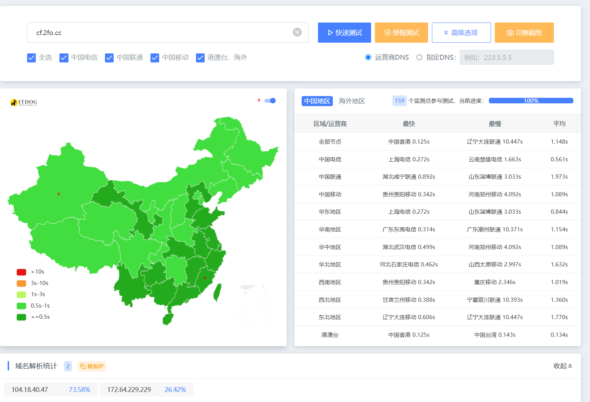

# 视频教程

`因为have殡的bilibili审核不通过只能这样了（）`

# 准备工作

1，首先你需要一个聪明(`牛逼`的脑袋`(至少配置是2核心，能处理两个以上的问题，不会的可以去问ai，实在还不会加群问我)`[👉戳我加群](https://qm.qq.com/q/uq2BcUDNJg)

2，你需要一个域名，可以用`免费域名`[👉戳我教你怎么注册](https://www.bilibili.com/video/BV1wwmdBjE1e)

3，你最好要有一个海外的魔法`cloudflare有时候会在加载仪表盘那里加载很久（）`

4，有一个能接收短信的`邮箱`(qq、网易、谷歌、outlook……都可以)

5，有一个要部署的`项目`

6，本文所有提及的`cf`的意思是`cloudflare`的缩写！

> [!TIP]
> 
>要部署的项目可以是node.js、html……都可以

# 大概的流程

### 部署一个cloudflare pages项目->添加cf默认给的💩解析->把默认的解析换成分流过后的

# 讲几个问题

`A:为什么不玩eo，vercel，netlify优选`

答:因为这些的官方开始打击优选ip`（主要是不想讲vercel，Netlify）`，如eo现在一优选就报错`418我只是一个茶壶`，就连一些老的添加的也不能用了（）
> [!TIP]
> 
> M4的Netfily限制积分，不知道为什么积分就没了`才一天就用完了`（78行为）

`A:会不会很深奥啊`

答:完全不会，我讲的只要有脑子&手基本都会

`A:会不会也像司马EdgeOne（intl）会418？`

答:完全不会！


### 1，打开cloudflare的pages如图所示，登录cf账号后依次打开以下目录


> [!TIP]
> 
> 你有现成的pages就用现成搭建好的pages，你说你是`小飞舞`不会？[👉戳我学cf 新建pages教程](https://www.bilibili.com/video/BV1gW53zqErG/)来自[@星雨若尘](https://space.bilibili.com/403434925)

### 2，打开你搞得好pages，在cloudflare pages的域名管理处添加你的域名

如图


点击你创建好的pages，如图，然后打开之后在那一行导航栏选择`自定义域`


到这个页面点击`设置自定义域`


在这里输入`你自己的域名`


进入这个页面你要添加一个域名`注意！本人亲自遭遇！如果你添加的域名是二级域名:XX.XXX.XXX那么你的域名可以不用托管在cf上，如果域名是XX.XXX顶级域名，你的域名一定要在cf上`


`我这里以华为云解析为例子`

cloudflare会给你一个XXX.pages.dev的域名和前缀，你要做的就是在你的dns解析商那里解析cf给你的地址


在华为云这里解析一下


然后回到cloudflare这里点击`检查dns记录，等个10分钟就差不多了，直到cloudflare显示活动`


就像这样

### 3，把默认的ip换成社区解析好的优选ip

就是把我们前面`解析的XXX.pages.dev`的这个记录值一整个替换成
```text
cloudflare.14131413.xyz
```
或者我们的超级二叉树树
```test
fenliu.072103.xyz
```

就像这样


### 4，验收成果

我们可以在[itdog](https://www.itdog.cn/ping)验收成果



嗯！~~`针不戳`！
