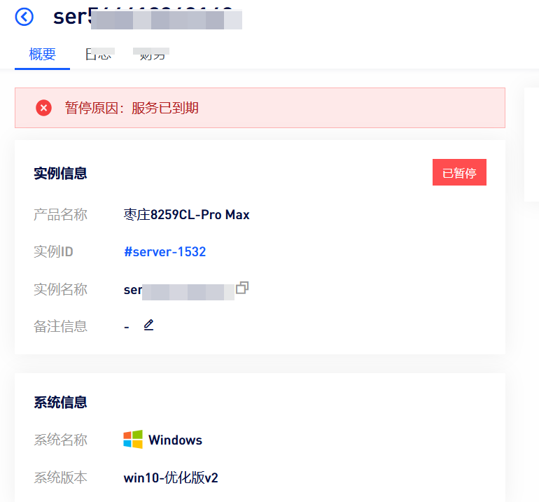
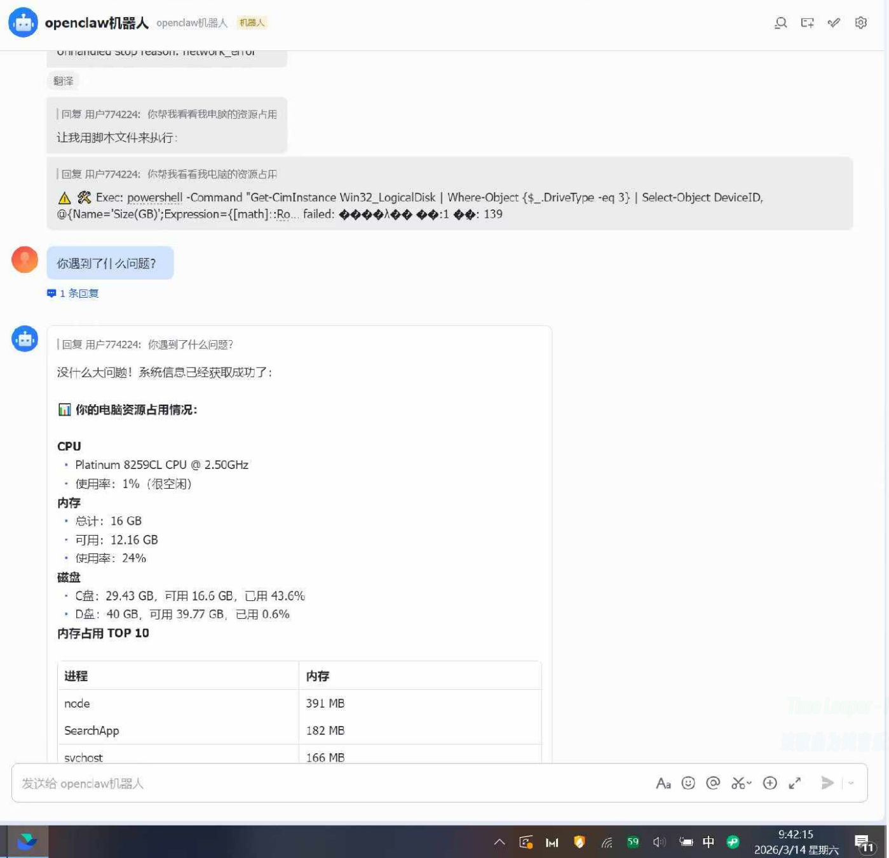

# 一切要从营销号吹爆了

今年年初，OpenClaw 突然火了。

打开社交媒体，到处都是这种标题：

> 「AI 自动打工神器来了」
> 「打工人要失业了」
> 「全自动办公，躺平赚钱」

看着挺唬人的。不过说实话，我第一反应就是——这不就是去年 DeepSeek 刚火那会儿差不多吗？

出于好奇，我问了朋友怎么看：

> [!TIP]
> 当时问得晚了，这玩意 2 月就开始火了

---

# 部署：过程顺利，结果尴尬

既然都吹这么狠了，我决定亲自试试。反正手头有台服务器`（这个是刚刚截图的）`:

接入飞书的过程还算顺利，技术难度不高：

部署完成后，问题来了——**模型不太行**（智谱的GLM4.7-Flash免费的30b）。
给我输出一下系统占用，用了将近1分钟
折腾了一下午，最后发现还不如我自己动手快。

---

# 为什么我说它是「坑」

## 没啥实际用途

这不是技术问题，是定位问题。

它既不能像 GPTs 那样自定义训练，也不能像企业级 AI 那样深度集成业务流程。说白了就是个「套壳工具」，能做的都很浅。

你能用它干嘛？

| 场景   | 实际效果         |
| ---- | ------------ |
| 写文档  | 质量参差不齐，得人工重写 |
| 做报表  | 格式经常出错，不如手动  |
| 自动回复 | 容易翻车，得有人盯着   |

新鲜感一过，它就是个占服务器资源的摆设。

> ~~我到服务器过期都没想好它能干嘛，新鲜感就几小时~~

## 安全问题不小

查了一下公开数据：**历史披露漏洞 258 个**，其中包含大量超危和高危漏洞。

这意味着什么？

你把它部署在服务器上 ≈ 给黑客留了个后门。

如果只是个人玩玩倒也罢了，要是企业拿它处理业务数据，风险自己掂量。

更关键的是，官方更新维护的积极性让人怀疑。对比同类型开源项目，这种态度真的不太行。

## 投入产出太不划算

算一笔账：

| 成本项目  | 说明        | 价格     |
| ----- | --------- | ------ |
| 服务器   | 需要持续运行    | 起步40   |
| Token | 消耗大，跑起来烧钱 | 起步每月50 |
| 时间    | 配置、调试、踩坑  | 24h盯着  |
| 精力    | 盯着它别翻车    | …………   |

实际产出呢？几乎为零。

同样的成本，用 其他ai编程工具不香吗；如果是企业需求，不如直接上成熟的企业方案。

---

# 写在最后

OpenClaw 不是一无是处，但确实被过度包装了。

我的结论很简单：

1. **营销 > 实际**：吹得厉害，用起来一般
2. **安全有坑**：漏洞多，维护差
3. **用处有限**：新鲜劲过了就吃灰
4. **不划算**：费钱费力没产出

当然，这只是我的个人体验。也许你有特殊场景用得上，或者单纯想折腾学习一下，那也挺好。

但如果你是被营销号种草、想靠它「躺平赚钱」——建议冷静一下。

**天上不会掉馅饼，掉下来的通常是坑。**

> [!WARNING]
> 本文仅代表个人使用体验，基于 2026 年初的项目状态。技术迭代快，项目可能已有变化，请以实际情况为准。